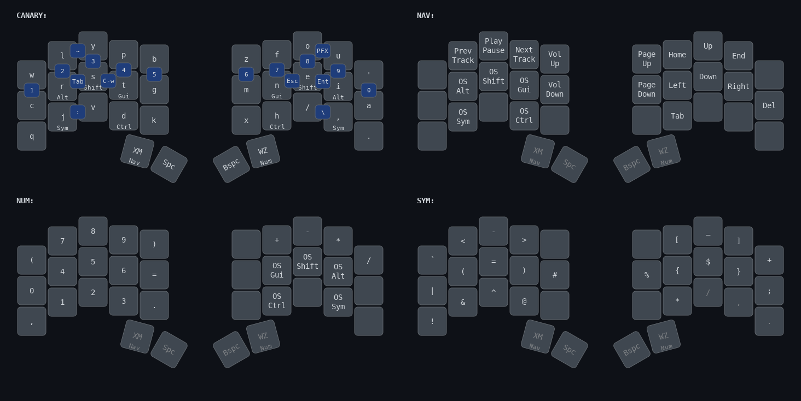

# QMK Keymaps

<div align="center">

</div>

## Table of Contents
- [Installation](#installation)
- [About](#about)
- [Features](#features)
- [My Keymap](#my-keymap)
- [References](#references)

## Installation

### Prerequisites
Follow the [getting started](https://docs.qmk.fm/#/newbs_getting_started) docs to install [QMK Firmware](https://docs.qmk.fm/#/)

### Setup
```sh
# Clone the userspace
git clone https://github.com/althyria/qmk_userspace.git

# Configure QMK to use external userspace
qmk config user.overlay_dir="$(realpath qmk_userspace)"

# Compile for Ferris Sweep
qmk compile -kb ferris/sweep -km jasmine

# Flash to keyboard (enter bootloader mode first)
qmk flash -kb ferris/sweep -km jasmine
```

## About

This is a custom QMK userspace for the Ferris Sweep keyboard, featuring the **[Canary layout](https://github.com/Apsu/Canary)** - a collaborative design by the Alternate Keyboard Layout (AKL) community with over 55% rolling trigrams for a flowy typing feel. The keymap includes extensive customizations for improved typing efficiency, emphasizing minimal finger movement through home row mods, combos, and application prefix keys on the thumbs.

### Design Philosophy
- **Comfort first**: All frequently used keys accessible without leaving home position
- **Reduced friction**: Common mistakes and shortcuts handled transparently
- **Minimal layers**: 5 carefully designed layers with logical access patterns

## Features

### Autocorrect
Automatically fixes common typing mistakes in real-time. Maintains a dictionary of frequently mistyped words and corrects them as you type, reducing the need for manual backspacing and retyping.

### Combos
Press multiple keys simultaneously to output different characters or trigger actions. Enables access to numbers, symbols, and commands without leaving the home position, reducing finger travel and improving typing efficiency.

### Home Row Mods
Modifier keys (Alt, Shift, GUI, Ctrl) placed on the home row as dual-function keys. Tap for the letter, hold for the modifier. Eliminates the need to reach for traditional modifier positions, reducing hand movement and strain.

### Prefix Keys
Dual-function thumb keys that serve as both layer activators and application prefix keys:
- **Xmonad Prefix**:
    - Tap to send the xmonad window manager prefix, hold for the NAV layer
- **Wezterm Prefix:**
    - Tap to send the WezTerm terminal prefix, hold for the NUM layer

## My Keymap

<div align="center">

</div>

## References

**[Precondition](https://precondition.github.io/home-row-mods)**<br>
Home row mods timing and configuration guidance

**[Pascal Getreuer](https://getreuer.info/posts/keyboards/index.html)**<br>
Advanced QMK features and custom keycodes

**[Jonas Hietala](https://www.jonashietala.se/series/t-34/)**<br>
Keyboard layout development journey
